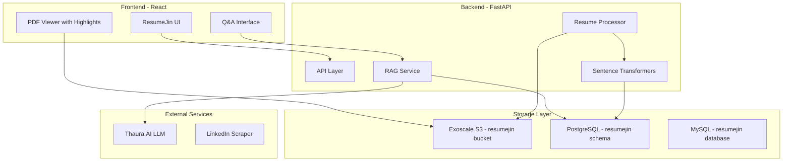

# ResumeJin Platform Build Plan

## Requirements Summary

Based on the 28 questions answered:

- **Auth**: Magic link/OTP (like HaqNow)
- **Users**: Single role, fully isolated multi-tenant data
- **Pricing**: Free (side project)
- **Files**: PDF, Word, Images, LinkedIn (URL scrape + PDF export)
- **Limits**: 50 resumes per job, 1-year retention
- **JD Input**: Text paste OR file upload
- **AI Features**: Match percentage score, freeform + suggested questions, concise answers, High/Medium/Low confidence
- **Citations**: PDF viewer with highlighted sections
- **UI**: Minimal/clean, desktop-first, English UI (any language resumes)
- **LLM**: Thaura.AI
- **Timeline**: 1 month polished MVP
- **Domain**: resumejin.com

---

## Architecture Overview



---

## Infrastructure Setup

### Kubernetes Namespace

Create new namespace `resumejin` in existing SKS cluster:

```yaml
apiVersion: v1
kind: Namespace
metadata:
  name: resumejin
  labels:
    project: resumejin
```


### Network Load Balancer

New NLB for resumejin.com (~$15/month):

- Port 443 → NodePort 32100 (different from HaqNow's 31993)
- Port 80 → NodePort 32101

### Database Strategy

Use existing Exoscale DBaaS with schema/database isolation:

- **PostgreSQL**: New schema `resumejin` for RAG vectors
- **MySQL**: New database `resumejin` for app data

### DNS

Point `resumejin.com` and `www.resumejin.com` directly to new NLB IP (no Deflect)---

## Repository Structure

```javascript
resumejin/
├── .env                          # Credentials (separate from HaqNow)
├── .cursorrules                  
├── CURSOR_CONTEXT.md            
├── backend/
│   ├── app/
│   │   ├── main.py              # FastAPI entry
│   │   ├── services/
│   │   │   ├── rag_service.py   # Forked from HaqNow, adapted for resumes
│   │   │   ├── resume_processor.py
│   │   │   ├── linkedin_service.py
│   │   │   └── otp_service.py   # Reuse pattern from HaqNow
│   │   ├── models/
│   │   │   ├── job_posting.py
│   │   │   ├── resume.py
│   │   │   └── user.py
│   │   ├── apis/
│   │   │   ├── auth.py
│   │   │   ├── jobs.py
│   │   │   ├── resumes.py
│   │   │   └── qa.py
│   │   └── database/
│   │       ├── database.py      # MySQL connection
│   │       └── rag_database.py  # PostgreSQL connection
│   ├── Dockerfile
│   └── requirements.txt
├── frontend/
│   ├── src/
│   │   ├── components/
│   │   │   ├── JobPostingForm.tsx
│   │   │   ├── ResumeUploader.tsx      # Drag & drop, ZIP, folder
│   │   │   ├── QAInterface.tsx
│   │   │   ├── PDFViewerWithHighlights.tsx
│   │   │   ├── CandidateList.tsx
│   │   │   └── MatchScoreCard.tsx
│   │   └── pages/
│   │       ├── Dashboard.tsx
│   │       ├── JobDetail.tsx
│   │       └── Login.tsx
│   ├── Dockerfile
│   └── package.json
├── k8s/
│   ├── .kubeconfig              # Same kubeconfig (shared cluster)
│   └── manifests/
│       ├── namespace.yaml
│       ├── backend-deployment.yaml
│       ├── frontend-deployment.yaml
│       ├── ingress.yaml         # host: resumejin.com
│       └── secrets.yaml.template
├── terraform/
│   └── nlb.tf                   # NLB only (references existing cluster)
└── scripts/
    └── deploy.sh
```

---

## Database Schema

### MySQL (resumejin database)

```sql
-- Users table
CREATE TABLE users (
    id INT AUTO_INCREMENT PRIMARY KEY,
    email VARCHAR(255) UNIQUE NOT NULL,
    created_at TIMESTAMP DEFAULT CURRENT_TIMESTAMP
);

-- OTP codes for magic link auth
CREATE TABLE otp_codes (
    id INT AUTO_INCREMENT PRIMARY KEY,
    email VARCHAR(255) NOT NULL,
    code VARCHAR(6) NOT NULL,
    expires_at TIMESTAMP NOT NULL,
    used BOOLEAN DEFAULT FALSE
);

-- Job postings
CREATE TABLE job_postings (
    id INT AUTO_INCREMENT PRIMARY KEY,
    user_id INT NOT NULL,
    title VARCHAR(255) NOT NULL,
    description TEXT NOT NULL,
    description_file_path VARCHAR(500),
    created_at TIMESTAMP DEFAULT CURRENT_TIMESTAMP,
    FOREIGN KEY (user_id) REFERENCES users(id)
);

-- Resumes (candidate pool)
CREATE TABLE resumes (
    id INT AUTO_INCREMENT PRIMARY KEY,
    user_id INT NOT NULL,
    candidate_name VARCHAR(255),
    file_path VARCHAR(500) NOT NULL,
    file_type VARCHAR(50),
    source ENUM('upload', 'linkedin_url', 'linkedin_pdf') DEFAULT 'upload',
    raw_text TEXT,
    uploaded_at TIMESTAMP DEFAULT CURRENT_TIMESTAMP,
    expires_at TIMESTAMP,  -- 1 year retention
    FOREIGN KEY (user_id) REFERENCES users(id)
);

-- Job-Resume associations
CREATE TABLE job_resumes (
    job_id INT NOT NULL,
    resume_id INT NOT NULL,
    match_score DECIMAL(5,2),  -- 0-100 percentage
    processed BOOLEAN DEFAULT FALSE,
    PRIMARY KEY (job_id, resume_id),
    FOREIGN KEY (job_id) REFERENCES job_postings(id),
    FOREIGN KEY (resume_id) REFERENCES resumes(id)
);
```


### PostgreSQL (resumejin schema)

```sql
CREATE SCHEMA resumejin;

-- Resume chunks for RAG
CREATE TABLE resumejin.resume_chunks (
    id SERIAL PRIMARY KEY,
    resume_id INT NOT NULL,
    job_id INT,  -- Optional: for job-specific context
    chunk_text TEXT NOT NULL,
    chunk_index INT NOT NULL,
    page_number INT,
    start_char INT,  -- For highlighting
    end_char INT,
    embedding vector(768),
    created_at TIMESTAMP DEFAULT CURRENT_TIMESTAMP
);

CREATE INDEX ON resumejin.resume_chunks USING ivfflat (embedding vector_cosine_ops);
```

---

## Core Features (MVP)

### 1. Authentication

- Magic link OTP via email (fork from HaqNow's `otp_service.py`)
- JWT session tokens

### 2. Job Posting Management

- Create job posting with title + description (text or file)
- View list of job postings
- Delete job posting (cascades to associations)

### 3. Resume Upload

- **Drag & drop**: Multiple files at once
- **ZIP upload**: Extract and process all PDFs/DOCXs
- **Folder picker**: Browser folder selection API
- **LinkedIn**: 
- Paste URL → scrape public profile
- Upload LinkedIn PDF export
- Progress bar showing X of Y processed

### 4. Candidate Pool

- View all uploaded resumes (user's pool)
- Assign resumes to job postings
- Upload new resumes directly to a job

### 5. AI Q&A Interface

- Freeform question input
- Suggested questions:
- "Who has the most experience with [skill]?"
- "Which candidates best match this job?"
- "Compare the top 3 candidates"
- "Who has worked at a Fortune 500 company?"
- Concise answers with High/Medium/Low confidence
- AI chooses display format (list, cards, comparison)

### 6. PDF Viewer with Highlights

- Click citation → opens PDF viewer
- Highlights the specific sentence/paragraph referenced
- Page navigation
- Use react-pdf or pdf.js

### 7. Match Scoring

- Automatic match percentage when resume is added to job
- Based on embedding similarity between JD and resume

---

## Key Files to Fork from HaqNow

| HaqNow File | ResumeJin Adaptation ||-------------|---------------------|| [backend/app/services/rag_service.py](backend/app/services/rag_service.py) | Adapt for resume context, add match scoring || [backend/app/services/otp_service.py](backend/app/services/otp_service.py) | Reuse with minor branding changes || [backend/app/database/rag_database.py](backend/app/database/rag_database.py) | Change schema to `resumejin` || [frontend/src/components/RAGQuestionAnswering.tsx](frontend/src/components/RAGQuestionAnswering.tsx) | Adapt for resume Q&A UI || [scripts/deploy.sh](scripts/deploy.sh) | Modify for resumejin namespace || [k8s/manifests/](k8s/manifests/) | New namespace, ingress for resumejin.com |---

## Implementation Phases

### Phase 1: Infrastructure (Days 1-3)

- Create new GitHub repo `resumejin`
- Set up Terraform for NLB
- Create K8s namespace and manifests
- Set up databases (MySQL database + PostgreSQL schema)
- Configure DNS for resumejin.com
- Set up S3 bucket for resume storage

### Phase 2: Backend Core (Days 4-10)

- Fork and adapt backend from HaqNow
- Implement user auth (OTP)
- Implement job posting CRUD
- Implement resume upload (all formats)
- Implement resume processing pipeline
- Implement RAG service for resumes
- Implement match scoring

### Phase 3: Frontend Core (Days 11-20)

- Set up React app with minimal/clean design
- Login page (magic link)
- Dashboard (list of job postings)
- Job detail page (resumes + Q&A)
- Resume uploader component (drag/drop, ZIP, folder)
- Q&A interface with suggested questions
- PDF viewer with highlighting

### Phase 4: Polish & Deploy (Days 21-30)

- Progress bar for bulk uploads
- LinkedIn URL scraping
- Confidence indicators
- Session history (in-memory)
- Testing and bug fixes
- Production deployment
- SSL certificate setup

---

## Technical Stack

- **Frontend**: React + TypeScript + Vite + TailwindCSS
- **Backend**: FastAPI + Python 3.11
- **LLM**: Thaura.AI
- **Embeddings**: sentence-transformers (all-mpnet-base-v2, 768-dim)
- **Vector DB**: PostgreSQL + pgvector
- **App DB**: MySQL
- **Storage**: Exoscale S3
- **PDF Processing**: PyMuPDF (fitz) for text extraction + page info
- **PDF Viewer**: react-pdf or @react-pdf-viewer/core
- **Infrastructure**: Exoscale SKS (shared cluster), new NLB